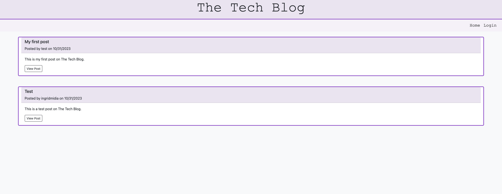

# Tech Blog

## Description
This is a CMS-style blog, where developers can publish their blog posts and comment on other developers’ posts as well. This application uses Handlebars.js as the templating language, Sequelize as the ORM, and the express-session npm package for authentication. Bootstrap is used in the blog design.

If you want to use the blog you can sign up or use the test user (username: test and password: 12345678).

## [Deployed Website](https://ingrid-tech-blog-5ff7d16ff03b.herokuapp.com/)

